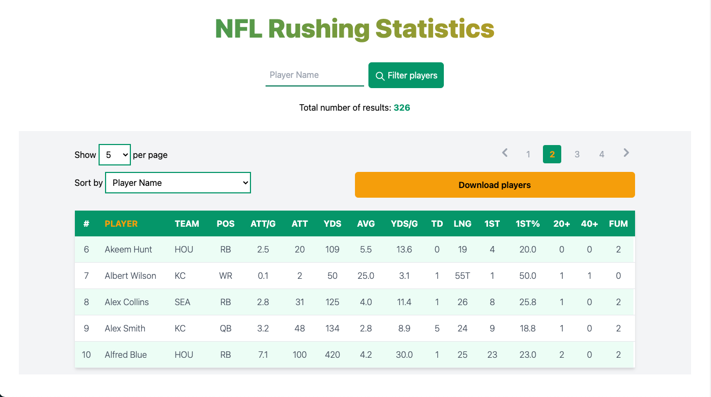
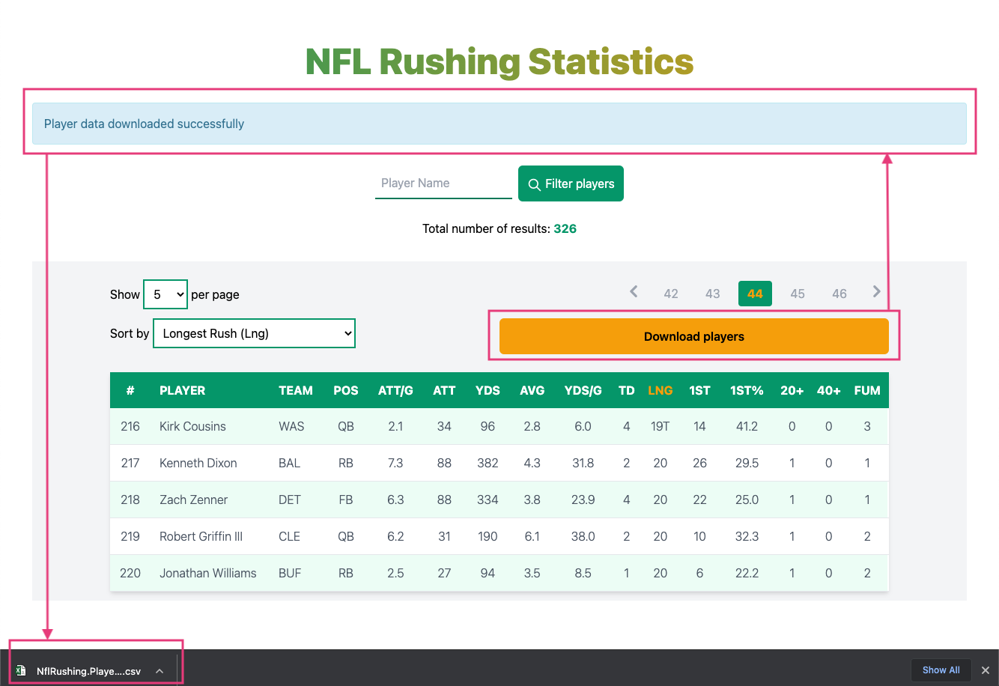

# theScore "the Rush" Interview Challenge
At theScore, we are always looking for intelligent, resourceful, full-stack developers to join our growing team. To help us evaluate new talent, we have created this take-home interview question. This question should take you no more than a few hours.

**All candidates must complete this before the possibility of an in-person interview. During the in-person interview, your submitted project will be used as the base for further extensions.**

### Why a take-home challenge?
In-person coding interviews can be stressful and can hide some people's full potential. A take-home gives you a chance work in a less stressful environment and showcase your talent.

We want you to be at your best and most comfortable.

### A bit about our tech stack
As outlined in our job description, you will come across technologies which include a server-side web framework (like Elixir/Phoenix, Ruby on Rails or a modern Javascript framework) and a front-end Javascript framework (like ReactJS)

### Challenge Background
We have sets of records representing football players' rushing statistics. All records have the following attributes:
* `Player` (Player's name)
* `Team` (Player's team abbreviation)
* `Pos` (Player's postion)
* `Att/G` (Rushing Attempts Per Game Average)
* `Att` (Rushing Attempts)
* `Yds` (Total Rushing Yards)
* `Avg` (Rushing Average Yards Per Attempt)
* `Yds/G` (Rushing Yards Per Game)
* `TD` (Total Rushing Touchdowns)
* `Lng` (Longest Rush -- a `T` represents a touchdown occurred)
* `1st` (Rushing First Downs)
* `1st%` (Rushing First Down Percentage)
* `20+` (Rushing 20+ Yards Each)
* `40+` (Rushing 40+ Yards Each)
* `FUM` (Rushing Fumbles)

In this repo is a sample data file [`rushing.json`](/rushing.json).

##### Challenge Requirements
1. Create a web app. This must be able to do the following steps
    1. Create a webpage which displays a table with the contents of [`rushing.json`](/rushing.json)
    2. The user should be able to sort the players by _Total Rushing Yards_, _Longest Rush_ and _Total Rushing Touchdowns_
    3. The user should be able to filter by the player's name
    4. The user should be able to download the sorted data as a CSV, as well as a filtered subset
    
2. The system should be able to potentially support larger sets of data on the order of 10k records.

3. Update the section `Installation and running this solution` in the README file explaining how to run your code

### Submitting a solution
1. Download this repo
2. Complete the problem outlined in the `Requirements` section
3. In your personal public GitHub repo, create a new public repo with this implementation
4. Provide this link to your contact at theScore

We will evaluate you on your ability to solve the problem defined in the requirements section as well as your choice of frameworks, and general coding style.

### Help
If you have any questions regarding requirements, do not hesitate to email your contact at theScore for clarification.

### Installation and running this solution

#### Technology versions
   *. This Liveview application was implemented and tested using Elixir 1.11.3 (compiled with Erlang/OTP 23).  
   *. Browser testing was done with Google Chrome.
   *. This application loads data into a PostgreSQL database, and queries from it.

#### Installation
1. Install PostgreSQL from https://www.postgresql.org/download
2. Download this challenge code from https://github.com/justingamble/nfl_rushing
    1. Recommended: git clone git@github.com:justingamble/nfl_rushing.git
    2. Alternatively, download code as a zip file and then unzip the file inside a new directory.
3. Change directory to the 'nfl_rushing' code directory.
    1. cd nfl_rushing
4. Install version 1.11.3 of Elixir (preferably compiled with Erlang/OTP 23)
    1. If you are using asdf to manage Elixir versions, these commands can be executed inside the 'nfl_rushing' directory:
        /* Ensure asdf plugins are up-to-date */
        asdf plugin-add erlang
        asdf plugin-add elixir
        asdf plugin-update erlang
        asdf plugin-update elixir
        /* Install erlang, and set it as the version to use in this directory */
        asdf install erlang 23.3.4.2
        asdf local erlang 23.3.4.2 
        /* Install elixir, and set it as the version to use in this directory */
        asdf install elixir 1.11.3-otp-23
        asdf local elixir 1.11.3-otp-23
6. Run:
      mix setup
      mix do deps.get, compile
   to download the dependencies and compile the app.  You may see some warning messages, these can be ignored.
7. In your favourite editor, open 'config/dev.exs' and look at the section starting with:
      config :nfl_rushing, NflRushing.Repo

   These are the settings that the app will use to connect to your database,
   so double-check them to make sure they'll work.  In particular, make sure
   the username and password are correct.
8. In your terminal, run:
      mix ecto.setup

   You should see output like this:
      Sample data successfully loaded.

   You can test by opening mix and running one line of code.
      iex -S mix
      NflRushing.PlayerStats.count([])

   (the response should be a single integer, which at time of this writing is: 326)

#### Screenshots

User interface:

After pressing the "Download players" button:

#### Running the automated tests

   mix test

#### Running the application
  
   mix phx.server

#### To reset the data:
   mix ecto.reset

### Limitations: 
- sorting by T (T is simply ignored)