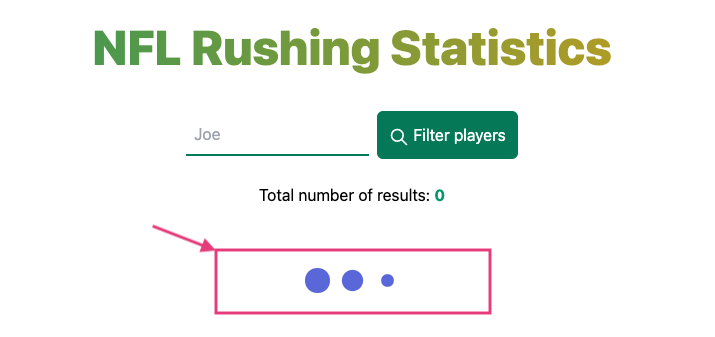

# theScore "the Rush" Interview Challenge
At theScore, we are always looking for intelligent, resourceful, full-stack developers to join our growing team. To help us evaluate new talent, we have created this take-home interview question. This question should take you no more than a few hours.

**All candidates must complete this before the possibility of an in-person interview. During the in-person interview, your submitted project will be used as the base for further extensions.**

### Why a take-home challenge?
In-person coding interviews can be stressful and can hide some people's full potential. A take-home gives you a chance work in a less stressful environment and showcase your talent.

We want you to be at your best and most comfortable.

### A bit about our tech stack
As outlined in our job description, you will come across technologies which include a server-side web framework (like Elixir/Phoenix, Ruby on Rails or a modern Javascript framework) and a front-end Javascript framework (like ReactJS)

### Challenge Background
We have sets of records representing football players' rushing statistics. All records have the following attributes:
* `Player` (Player's name)
* `Team` (Player's team abbreviation)
* `Pos` (Player's postion)
* `Att/G` (Rushing Attempts Per Game Average)
* `Att` (Rushing Attempts)
* `Yds` (Total Rushing Yards)
* `Avg` (Rushing Average Yards Per Attempt)
* `Yds/G` (Rushing Yards Per Game)
* `TD` (Total Rushing Touchdowns)
* `Lng` (Longest Rush -- a `T` represents a touchdown occurred)
* `1st` (Rushing First Downs)
* `1st%` (Rushing First Down Percentage)
* `20+` (Rushing 20+ Yards Each)
* `40+` (Rushing 40+ Yards Each)
* `FUM` (Rushing Fumbles)

In this repo is a sample data file [`rushing.json`](/rushing.json).

##### Challenge Requirements
1. Create a web app. This must be able to do the following steps
    1. Create a webpage which displays a table with the contents of [`rushing.json`](/rushing.json)
    2. The user should be able to sort the players by _Total Rushing Yards_, _Longest Rush_ and _Total Rushing Touchdowns_
    3. The user should be able to filter by the player's name
    4. The user should be able to download the sorted data as a CSV, as well as a filtered subset
    
2. The system should be able to potentially support larger sets of data on the order of 10k records.

3. Update the section `Installation and running this solution` in the README file explaining how to run your code

### Submitting a solution
1. Download this repo
2. Complete the problem outlined in the `Requirements` section
3. In your personal public GitHub repo, create a new public repo with this implementation
4. Provide this link to your contact at theScore

We will evaluate you on your ability to solve the problem defined in the requirements section as well as your choice of frameworks, and general coding style.

### Help
If you have any questions regarding requirements, do not hesitate to email your contact at theScore for clarification.

### Installation and running this solution

1. Install PostgreSQL from https://www.postgresql.org/download
2. Download Justin's application code from https://github.com/justingamble/nfl_rushing
    1. Recommended: `git clone git@github.com:justingamble/nfl_rushing.git`
    2. Alternatively, download code as a zip file and then unzip the file inside a new directory.
3. Change to the `nfl_rushing` code directory.
```bash
        cd nfl_rushing
```
4. Install version 1.11.3 of Elixir (preferably compiled with Erlang/OTP 23)
    1. If you are using [asdf](https://github.com/asdf-vm/asdf) to manage Elixir versions, these commands can be executed inside the `nfl_rushing` directory:
```bash
        # Ensure asdf plugins are up-to-date 
        asdf plugin-add erlang
        asdf plugin-add elixir
        asdf plugin-update erlang
        asdf plugin-update elixir

        # Install erlang, and set it as the version to use while in this directory 
        asdf install erlang 23.3.4.2
        asdf local erlang 23.3.4.2

        # Install elixir, and set it as the version to use while in this directory
        asdf install elixir 1.11.3-otp-23
        asdf local elixir 1.11.3-otp-23
```

5. In your favourite editor, open `config/dev.exs` and `config/test.exs`.  For each file, locate the section
   starting with:
```elixir
        config :nfl_rushing, NflRushing.Repo
```
This section contains the settings the application will use to connect to your database.  Double-check them to make sure they'll work.  In particular, make sure the username and password are correct.

6. Run the following commands inside the `nfl_rushing` directory to 
   download the dependencies, compile the application, and populate the
   data in the database.  You may see some warning messages, these can 
   be ignored.
```elixir
        mix setup
        mix do deps.get, compile
```

Part of the output includes a number of `INSERT INTO "players" ("longest_rush", ...)` statements.  After all of these INSERT statements you should see output like this:
```
        Data successfully loaded!
```

For example:


7. Test your configuration by running `iex -S mix` and running one line of code: 
   `NflRushing.PlayerStats.count([])`.
   The response should be the single integer 326.
```elixir
        $ iex -S mix
        Erlang/OTP 23 [erts-11.2.2.2] [source] [64-bit] [smp:8:8] [ds:8:8:10] [async-threads:1] [hipe]

        Compiling 25 files (.ex)
        Generated nfl_rushing app
        Interactive Elixir (1.11.3) - press Ctrl+C to exit (type h() ENTER for help)
        iex(1)> NflRushing.PlayerStats.count([])
        [debug] QUERY OK source="players" db=1.5ms decode=1.6ms queue=1.4ms idle=1892.8ms
        SELECT count(p0."id") FROM "players" AS p0 []
        326
        iex(2)>
```

Press Ctrl-C twice to exit the iex shell.

8. (optional) Inside the `nfl_rushing` directory, verify all the automated tests pass:

```elixir
   $ mix test
```

9. (optional) Inside the `nfl_rushing` directory, review the test coverage:

```elixir
   $ MIX_ENV=test mix coveralls
```

Alternatively, to write an HTML version of the report to the `covers/` folder:

```elixir
   $ MIX_ENV=test mix coveralls.html
```

10. Inside the `nfl_rushing` directory, launch the Phoenix server:

```elixir
    mix phx.server
```

11. In your web browser, navigate to http://localhost:4000/

You should see:


If you now press the "Download players" button, you should see flash message that indicates the file download was successful.


#### To reset the data:

If the player data in the database becomes corrupt, you can drop and recreate the database tables via:

```elixir
   mix ecto.reset
```

### Design Decisions

#### Overview
- Application was implemented and tested using Phoenix Liveview.
    - Elixir 1.11.3 (compiled with Erlang/OTP 23)  
    - Erlang 23.2.4.2
- Browser testing was done with Google Chrome.
- Front end interface was styled with [Tailwind CSS](https://tailwindcss.com/docs)
- This application loads data into a PostgreSQL database, and queries from it.

#### File Parsing and Loading
- Elixir code implements the data parsing and loading into the Ecto database. The code for the file loading is in [lib/nfl_rushing/player_stats/player_load.ex](https://github.com/justingamble/nfl_rushing/blob/main/lib/nfl_rushing/player_stats/player_load.ex) .  Advantages of using Elixir for this task:
    - Unit tests to confirm the `player_load.ex` works as expected. Unit tests are [here](https://github.com/justingamble/nfl_rushing/blob/main/test/nfl_rushing/player_load_test.exs) and work with [this sample data](https://github.com/justingamble/nfl_rushing/blob/main/test/nfl_rushing/fake_player_data.json).
    - An easy-to-maintain Elixir pipeline for the loading tasks.
    ```elixir
      def get_clean_player_stats_in_a_list_of_structs(filename) when is_binary(filename) do
        parse_json_file_into_a_list_of_structs(filename)
        |> clean_rushing_attempts_per_game_avg
        |> clean_total_rushing_yards
        |> clean_rushing_avg_yards_per_attempt
        |> clean_rushing_yards_per_game
        |> clean_rushing_first_down_percentage
        |> clean_longest_rush
      end
    ```

#### Sorting player records
- Some player records have a `LNG` field with an integer, others have an integer followed by `T`.  Example: `29T`.  When sorting on the LNG column, the application will first sort the records by the numeric value, and if there are multiple records with the same numeric value then the records with `T` are listed at the end.  For example, given these `LNG` values: ['23', '19', '23T', '23', '24'], when sorting by `LNG` the output will be in this order: ['19', '23', '23', '23T', '24'].  
- The user specifies a sort column from a dropbox. They can choose one of: Player Name, Total Rushing Yards (Yds), Total Rushing Touchdowns (TD), or Longest Rush (Lng)). The records are sorted on a primary and secondary column(s). By using a secondary column, the application guarantees an ordering for the player records that will be consistent for the webpage table as well as in the downloaded CSV file.
    - If Total Rushing Yards or Total Rushing Touchdowns is selected by the user, then the secondary column is the Player Name.
    - If the Player Name is selected by the user, then the secondary column is the database ID for the records.
    - If the Longest Rush is selected by the user, then there are two secondary columns.  First the record data is sorted by the numeric value of LNG, then by whether or not a trailing 'T' exists, and finally (if needed) by the Player Name.
- Tests for sorting are found [here](https://github.com/justingamble/nfl_rushing/blob/main/test/nfl_rushing_web/live/player_live_sort_test.exs) and [here](https://github.com/justingamble/nfl_rushing/blob/main/test/nfl_rushing_web/live/player_live_sort_and_filter_test.exs)

#### Filtering player records
- Users can filter on an exact name.  Example: "Adam Thielen".
- Users can filter on a partial name.  Example: "Adam" will return all records where the first or last names include the letters 'adam'.
- Searches are not case sensitive.  Searching on "adam" returns the same results as "ADAM".
- Tests for filtering are found [here](https://github.com/justingamble/nfl_rushing/blob/main/test/nfl_rushing_web/live/player_live_filter_test.exs) and [here](https://github.com/justingamble/nfl_rushing/blob/main/test/nfl_rushing_web/live/player_live_sort_and_filter_test.exs)

#### File download
- The download functionality is implemented using a Phoenix endpoint.  Once the download is complete, a message is sent to Phoenix PubSub.  The Phoenix Liveview application consumes the Phoenix PubSub message and displays a flash message to the user.
- The file being downloaded is streamed from the database to the user.  In particular, the data is not first written to a file on the web server.  The advantage of this approach is there is no need to subsequently cleanup the temporary files.
- Tests for the download behaviour are found [here](https://github.com/justingamble/nfl_rushing/blob/main/test/nfl_rushing_web/controllers/api/download_controller_test.exs) and [here](https://github.com/justingamble/nfl_rushing/blob/main/test/nfl_rushing_web/live/player_live_download_test.exs)


#### Scaling to support 10K players
- As mentioned in the File download section, the download functionality is implemented using streaming.  As the data is queried from the database, it is uploaded to the user.  The data is not all queried up-front, which means the download process should start right away - even for larger datasets.
- Pagination was added to avoid displaying all the records on a single page. This reduces load time. The pagination dropbox currently contains choices for 5, 10, 15, or 20 records/page. These can be changed to other sizes, if needed.
- A PostgreSQL database is used to store and query the player records.  Databases are designed to handle large data sets.
- When the user presses the filter button, or changes the sorting column, a "loading" icon is displayed. For larger datasets this provides immediate feedback to the user, while the data is being loaded.  For small datasets, like the sample 326 records, the loading icon disappears right away and is barely noticeable.

    

#### 404 page
- If the user navigates to http://localhost:4000, they are redirected to http://localhost:4000/players
- If the user navigates to a non-existent URL, they will see a 404 page that redirects them back to the Players listing:

    

- There is a unit test for the 404 behaviour included in 
[test/nfl_rushing_web/views/error_view_test.exs](https://github.com/justingamble/nfl_rushing/blob/main/test/nfl_rushing_web/views/error_view_test.exs)

